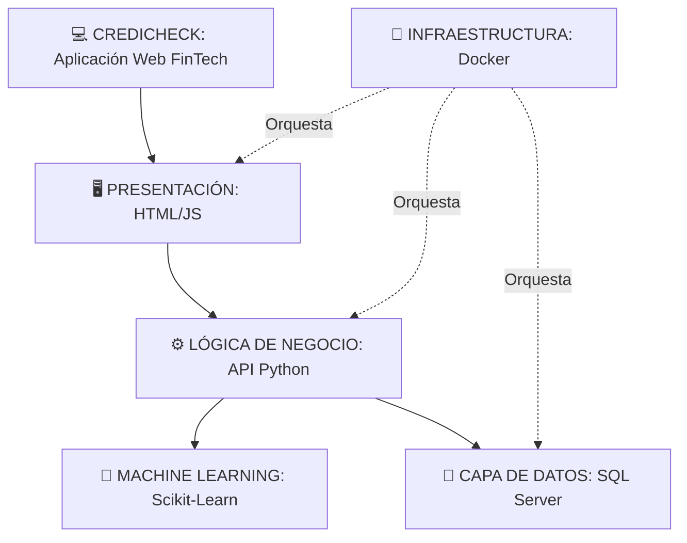

# Capstone_005D_proyectoFinal
## Descripción del Proyecto
CrediCheck es una plataforma FinTech web orientada a la pre-evaluación del riesgo crediticio y la educación financiera. A diferencia de los simuladores tradicionales que solo calculan cuotas o actúan como "cajas negras" rechazando solicitudes sin explicación, CrediCheck integra un modelo predictivo de Machine Learning que evalúa el perfil del usuario en un entorno seguro (sandbox). 

El sistema devuelve la probabilidad estadística de aprobación de un crédito y entrega recomendaciones preventivas y educativas para mejorar la salud financiera del usuario antes de que acuda al sistema bancario formal, evitando así rechazos que perjudiquen su historial.

## Tecnologías Utilizadas
El proyecto está estructurado bajo una arquitectura moderna y escalable, integrando las siguientes tecnologías:
* **Modelo Predictivo:** Python, Scikit-learn (Machine Learning).
* **Backend (API):** FastAPI / Flask.
* **Frontend:** HTML5, CSS3, JavaScript.
* **Base de Datos:** SQL Server.
* **Despliegue y Configuración de Ambientes:** Docker, Docker-Compose.
* **Control de Versiones:** Git / GitHub.

## Integrantes y Roles
Dado el carácter del desarrollo, el proyecto se ejecuta de manera individual, asumiendo integralmente todos los roles del ciclo de vida del software:
* **Daniel Ahumada Ubeda**
  * *Roles asumidos:* Data Scientist (Entrenamiento del modelo ML), Desarrollador Full-Stack (Backend/Frontend), Arquitecto Cloud (Despliegue en Docker) y QA (Pruebas de calidad).

## Metodología de Trabajo
Se utiliza una **Metodología Tradicional basada en el modelo en Cascada (Waterfall)**. Este enfoque secuencial permite mantener un control riguroso de la documentación y los tiempos al trabajar de forma individual, asegurando que cada etapa cuente con sus respectivas evidencias y validaciones antes de avanzar a la siguiente. Las fases son:
1. Análisis y Definición (Levantamiento y limpieza de datasets).
2. Diseño (Arquitectura y modelo relacional).
3. Implementación (Desarrollo algorítmico y Full-Stack).
4. Pruebas de Calidad (Unitarias y UAT).
5. Despliegue (Containerización).

## Arquitectura de la solución
CrediCheck utiliza una arquitectura modular basada en microservicios (containerizada), separando la interfaz de usuario, la API lógica, el motor predictivo y la persistencia de datos.

La aplicación está desarrollada utilizando HTML/JS/CSS para el frontend, Python (FastAPI/Flask) para la lógica de negocio y la API, Scikit-Learn para el modelo de Machine Learning, y SQL Server para la base de datos relacional. Todo el ecosistema está orquestado mediante Docker.

Arquitectura general:

CREDICHECK: Aplicación Web FinTech

CAPA DE PRESENTACIÓN: HTML5 | CSS3 | JS | Formulario de Simulación | Dashboard de Riesgo | Recomendaciones Educativas

LÓGICA DE NEGOCIO (API): Python (FastAPI / Flask) | Controladores REST

CAPA DE MACHINE LEARNING: Scikit-Learn | Pandas | Modelo de Clasificación de Riesgo

CAPA DE DATOS: Microsoft SQL Server | Historial de Simulaciones

INFRAESTRUCTURA: Docker | Docker-Compose

## Arquitectura general (Diagrama)

---
**Proyecto desarrollado para la asignatura Capstone - Ingeniería en Informática**
